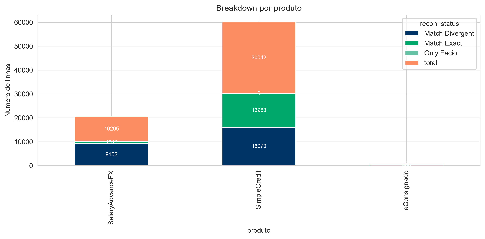
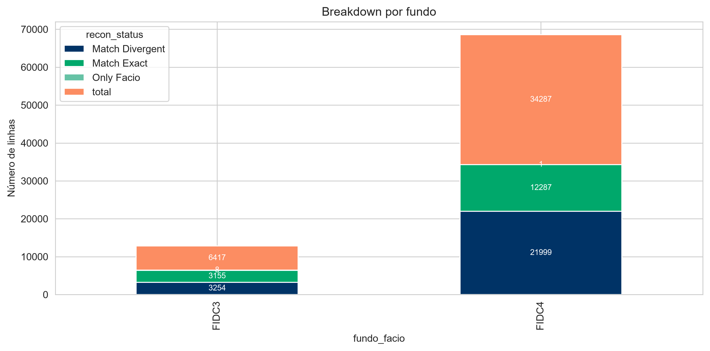
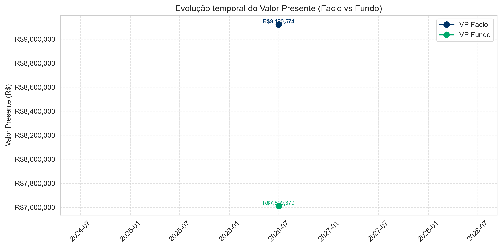

# Relatório de Conciliação Facio

## KPIs Gerais
- Total linhas: 49.999
- Match Exact: 15.442
- Match Divergent: 25.253
- Only Fundo: 9.295
- Only Facio: 9
- VP Facio: R$ 9.120.573,86
- VP Fundo: R$ 9.056.501,02
- Total abs diff: R$ 1.545.850,23

## Distribuição por Status

## Breakdown por Produto

## Breakdown por Fundo

## Top 10 Divergências

## Série Temporal de VP

## Mapping de Fundos
- FACIO 3 → FIDC3
- FACIO 4 → FIDC4
