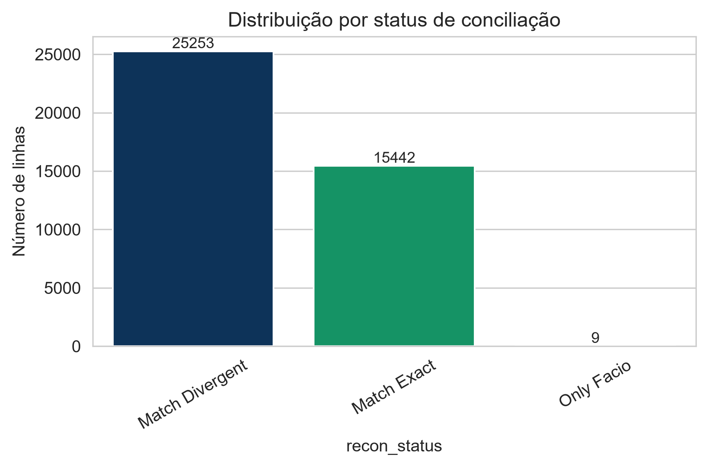
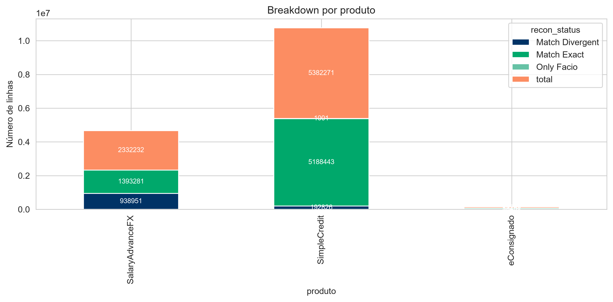
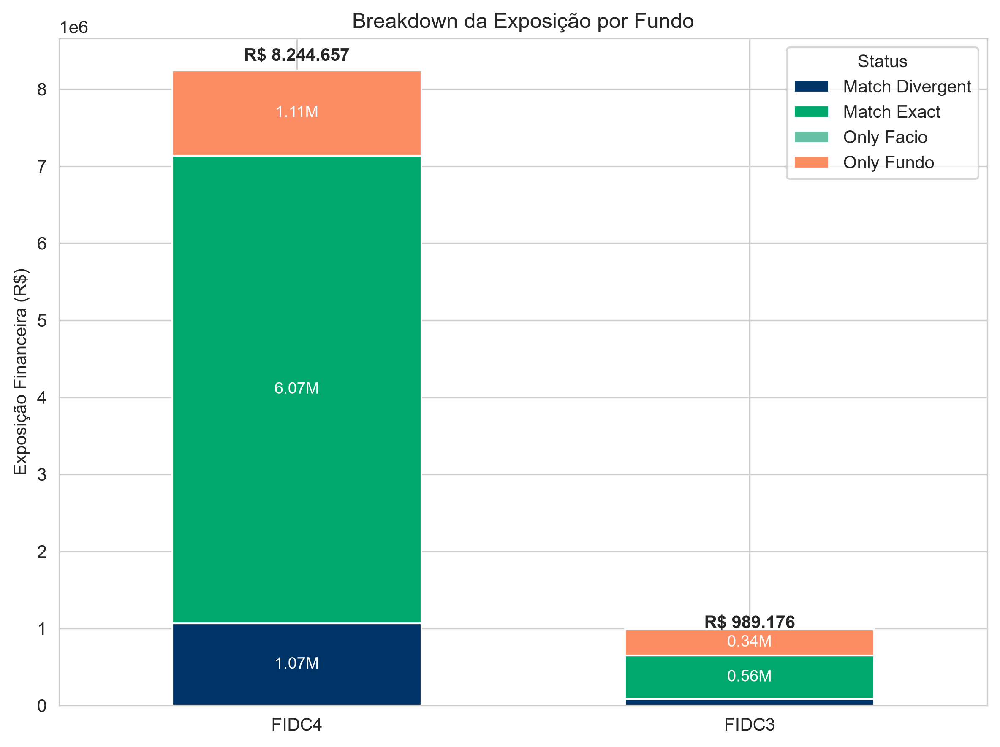
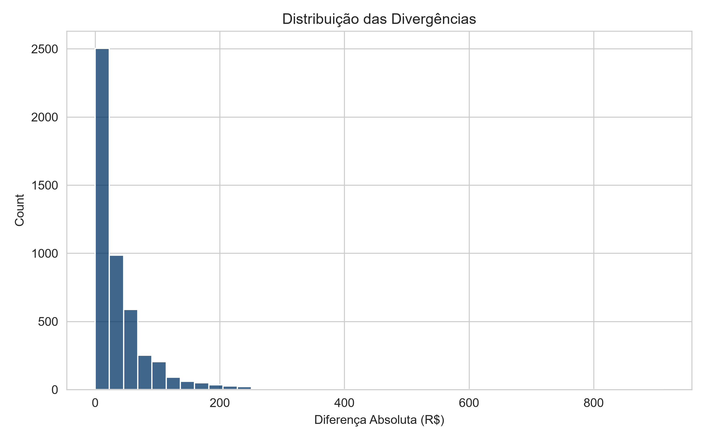
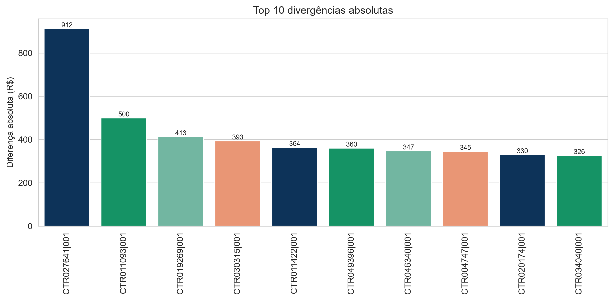
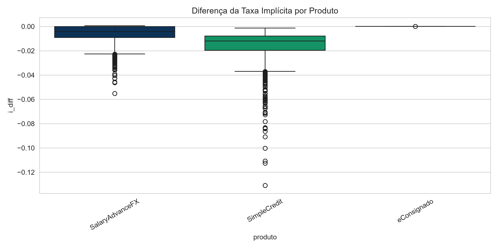
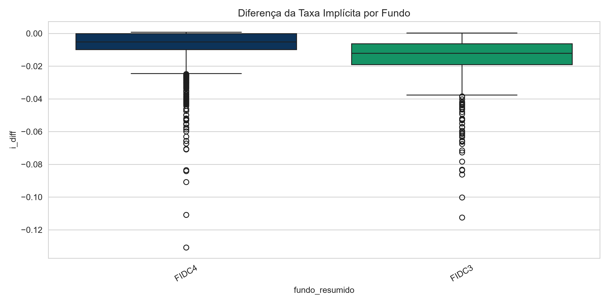
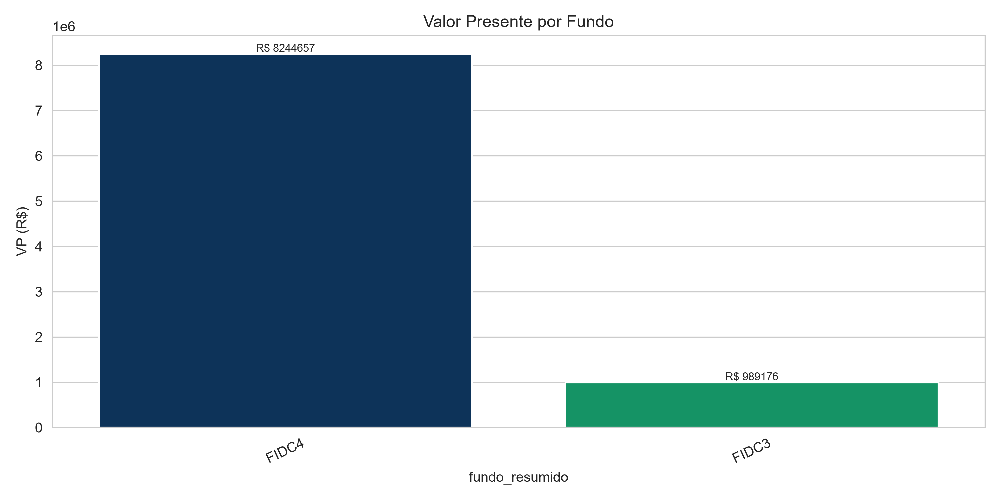
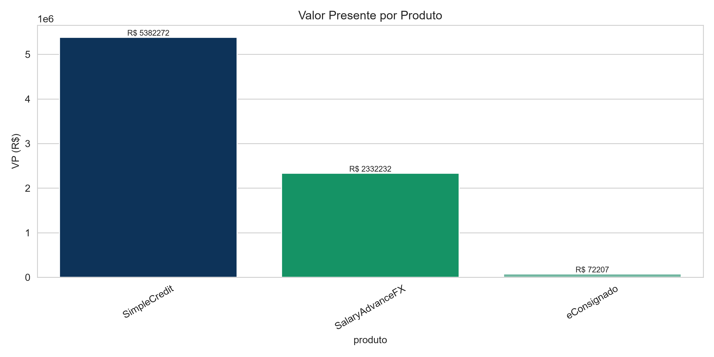
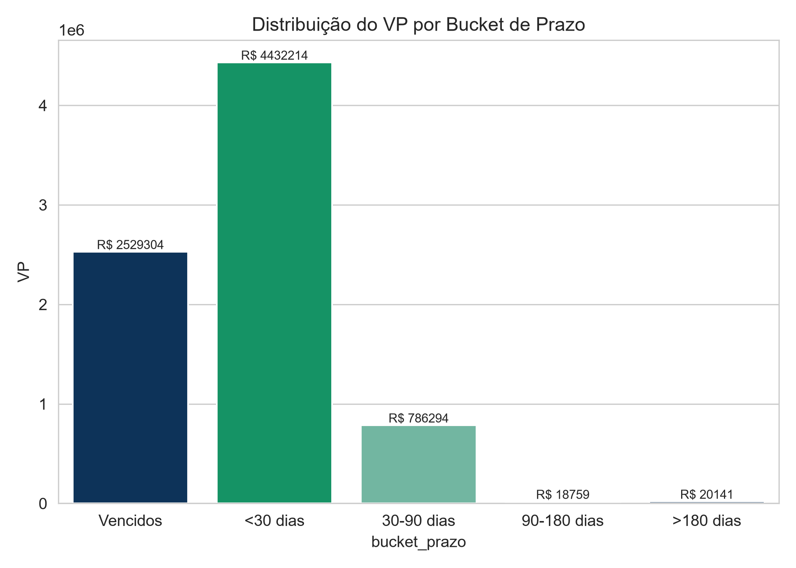

# Relatório Técnico – Case Facio
## Reconciliação Financeira entre Carteira Facio e Fundos

**Business Analyst Skills Case**

Autor: Caah Paiva

---

# Sumário

1. Objetivo
2. Metodologia
3. Premissas Adotadas
4. Questão 1 – Reconciliação da Carteira
5. Questão 2 – Análise da Exposição Financeira
6. Questão 3 – Taxa Implícita do Fundo
7. Questão 4 – Composição do Portfólio
8. Questão 5 – Hipóteses de Causa-Raiz
9. Recomendações Gerais
10. Conclusão Executiva


---

# Objetivo

O presente relatório apresenta a solução desenvolvida para o Case de Business Analyst da Facio, cujo objetivo consiste em realizar a conciliação financeira entre a posição da carteira interna da Facio e a posição reportada pelos Fundos, identificando divergências operacionais e financeiras.

Além da implementação da conciliação, foram produzidas análises quantitativas para avaliar o impacto financeiro das diferenças encontradas, identificar possíveis causas-raiz e propor recomendações de melhoria operacional.

Todo o processo foi desenvolvido em Python utilizando boas práticas de engenharia de dados, organização modular do código e geração automatizada de indicadores e visualizações.

---

# Metodologia

A solução foi construída em cinco etapas principais.

## 1. Tratamento dos dados

Inicialmente ambos os datasets foram padronizados.

Foram realizadas:

- normalização de textos;
- padronização das chaves;
- normalização do número da parcela;
- tratamento de campos nulos;
- conversão de datas;
- validação dos tipos das variáveis.

A normalização garante que diferenças de formatação não produzam falsos negativos durante a conciliação.

---

## 2. Construção da chave de conciliação

Cada parcela foi identificada por uma chave única composta por:

```
id_contrato + parcela
```

Essa chave permitiu localizar exatamente a mesma parcela nas duas bases.

---

## 3. Cálculo Financeiro

Para cada contrato foram calculados:

- Valor Presente (VP)
- Taxa implícita diária
- Diferença absoluta
- Diferença relativa

A taxa implícita foi obtida utilizando:

- Valor de Cessão
- Valor Presente
- Data da cessão
- Data de referência

---

## 4. Processo de Conciliação

Após o cálculo do VP, cada parcela foi classificada em um dos seguintes grupos.

| Status | Descrição |
|---------|-----------|
| Match Exact | Registro encontrado em ambas as bases sem diferença relevante |
| Match Divergent | Registro encontrado em ambas as bases com diferença financeira |
| Only Facio | Registro existente apenas na Facio |
| Only Fundo | Registro existente apenas no Fundo |

---

## 5. Geração dos Indicadores

Por fim foram produzidos:

- KPIs financeiros
- gráficos
- tabelas analíticas
- indicadores de concentração
- análise da taxa implícita
- análise de duration
- hipóteses de causa-raiz

Todos os gráficos seguem a identidade visual da Facio.

---

# Premissas Adotadas

Para garantir consistência durante a análise foram adotadas as seguintes premissas:

- a chave contrato + parcela identifica unicamente cada ativo;
- registros inexistentes em uma das bases foram classificados como Only Facio ou Only Fundo;
- divergências financeiras foram avaliadas através da diferença absoluta do Valor Presente;
- a taxa implícita foi calculada apenas para registros presentes nas duas bases com informações suficientes;
- a Duration foi calculada utilizando prazo restante ponderado pelo Valor Presente apenas para ativos ainda não vencidos.

---

# Questão 1 – Reconciliação da Carteira

## Objetivo

Identificar todas as diferenças existentes entre a carteira da Facio e a carteira dos Fundos.

---

## Metodologia

A conciliação foi realizada utilizando merge entre as duas bases através da chave:

```
Contrato + Parcela
```

Após o merge, cada registro foi classificado conforme o status da reconciliação.

---

## Resultado

| Status | Quantidade | Exposição Financeira |
|---------|-----------:|--------------------:|
| Match Exact | 35.849 | R$ 6,64 milhões |
| Match Divergent | 4.846 | R$ 1,15 milhão |
| Only Fundo | 9.295 | R$ 1,45 milhão |
| Only Facio | 9 | R$ 1 mil |

---

## Visualização



---

### Breakdown por Produto

| Produto | Exposição |
|----------|----------:|
| SimpleCredit | R$ 5,38 milhões |
| SalaryAdvanceFX | R$ 2,33 milhões |
| eConsignado | R$ 72 mil |



---

### Breakdown por Fundo

| Fundo | Exposição |
|--------|----------:|
| FIDC4 | R$ 8,24 milhões |
| FIDC3 | R$ 989 mil |



---

## Principais Achados

Os resultados demonstram que aproximadamente 72% da carteira conciliou integralmente.

Entretanto, chama atenção a existência de **9.295 registros classificados como Only Fundo**, representando cerca de **R$ 1,45 milhão**, indicando diferenças relevantes entre a posição operacional da Facio e a posição reportada pelos Fundos.

Também foram identificadas **4.846 parcelas conciliadas com divergência financeira**, sugerindo diferenças na metodologia de cálculo do Valor Presente.

---

## Recomendações

- Implantar reconciliação automática diária;
- Monitorar diariamente registros Only Fundo;
- Criar dashboards operacionais para acompanhamento dos breaks;
- Implementar alertas para divergências financeiras relevantes.

---

# Questão 2 – Análise da Exposição Financeira

## Metodologia

Foi consolidado o Valor Presente da carteira considerando:

- VP calculado pela Facio;
- VP informado pelo Fundo;
- classificação da reconciliação.

---

## Resultado

### Exposição por Status

| Status | VP |
|---------|---------:|
| Match Exact | R$ 6,64 milhões |
| Match Divergent | R$ 1,15 milhão |
| Only Fundo | R$ 1,45 milhão |
| Only Facio | R$ 1 mil |

---

### Exposição por Produto

| Produto | VP |
|---------|--------:|
| SimpleCredit | R$ 5,38 milhões |
| SalaryAdvanceFX | R$ 2,33 milhões |
| eConsignado | R$ 72 mil |

---

## Distribuição das Divergências

| Indicador | Valor |
|-----------|------:|
| Média | R$ 36,41 |
| Mediana | R$ 21,29 |
| Percentil 95 | R$ 131,48 |
| Máxima | R$ 911,94 |

---



---

### Top 10 Divergências



---

## Principais Achados

As divergências financeiras apresentam baixo impacto médio individual, porém existem outliers relevantes.

Grande parte das maiores diferenças encontra-se concentrada no produto **SalaryAdvanceFX**, especialmente no **FIDC4**.

---

## Recomendações

- Priorizar automaticamente divergências superiores a R$100;
- Investigar imediatamente diferenças acima de R$500;
- Criar trilhas automáticas de tratamento conforme materialidade.

---

# Questão 3 – Taxa Implícita do Fundo

## Metodologia

Foi calculada a taxa implícita diária utilizada pelo Fundo utilizando:

- Valor de Cessão;
- Valor Presente;
- Prazo entre cessão e data de referência.

Posteriormente a taxa foi comparada com a taxa calculada pela Facio.

---

## Resultado

| Indicador | Valor |
|-----------|------:|
| Taxa média Facio | 0,75% a.d. |
| Taxa média Fundo | -0,05% a.d. |
| Diferença média | -0,81 p.p. |

---

### Diferença por Produto

| Produto | Diferença Média |
|----------|----------------:|
| SimpleCredit | -1,64 p.p. |
| SalaryAdvanceFX | -0,57 p.p. |
| eConsignado | ≈ 0 |



---

### Diferença por Fundo

| Fundo | Diferença Média |
|--------|----------------:|
| FIDC3 | -1,45 p.p. |
| FIDC4 | -0,68 p.p. |



---

## Principais Achados

Foi identificado comportamento sistemático indicando utilização de metodologia distinta para cálculo do Valor Presente entre Facio e Fundos.

O produto **SimpleCredit** apresentou a maior diferença média de taxa implícita.

---

## Recomendações

- Formalizar documentação única da metodologia de cálculo do VP;
- Padronizar datas-base utilizadas pelos sistemas;
- Uniformizar políticas de arredondamento e tratamento de parcelas vencidas.


---

# Questão 4 – Composição e Concentração do Portfólio

## Objetivo

Avaliar a composição da carteira sob a ótica financeira, identificando concentrações por fundo, produto e prazo de vencimento, além de calcular a duration média ponderada e o percentual da carteira concentrado no curto prazo.

---

## Metodologia

A análise foi construída utilizando o Valor Presente (VP) como métrica de exposição financeira.

Foram calculados:

- VP consolidado por Fundo;
- VP consolidado por Produto;
- distribuição por bucket de vencimento;
- duration média ponderada pelo VP;
- percentual da carteira vencendo em até 30 dias.

A Duration foi calculada considerando apenas ativos ainda não vencidos, utilizando o prazo remanescente ponderado pelo Valor Presente.

---

# Exposição por Fundo

| Fundo | Valor Presente |
|--------|---------------:|
| FIDC4 | R$ 8,24 milhões |
| FIDC3 | R$ 989 mil |



---

## Análise

Observa-se elevada concentração financeira no **FIDC4**, responsável por aproximadamente **89% da exposição total da carteira**.

Essa concentração aumenta a dependência operacional e financeira do fundo, tornando eventuais divergências mais relevantes para o processo de reconciliação.

---

# Exposição por Produto

| Produto | Valor Presente |
|----------|---------------:|
| SimpleCredit | R$ 5,38 milhões |
| SalaryAdvanceFX | R$ 2,33 milhões |
| eConsignado | R$ 72 mil |



---

## Análise

O produto **SimpleCredit** representa a maior participação da carteira, seguido pelo **SalaryAdvanceFX**.

Essa distribuição é consistente com a concentração observada nas análises de divergência financeira, indicando que os produtos de maior exposição também concentram maior risco operacional.

---

# Distribuição por Prazo

| Bucket | Valor Presente |
|---------|---------------:|
| < 30 dias | R$ 6,96 milhões |
| 30–90 dias | R$ 786 mil |
| 90–180 dias | R$ 18,8 mil |
| >180 dias | R$ 20,1 mil |



---

## Análise

A carteira apresenta forte concentração em ativos de curto prazo.

Mais de **R$ 6,9 milhões** vencem em menos de 30 dias, indicando elevada necessidade de acompanhamento operacional e atualização frequente das posições conciliadas.

---

# Duration Média

A Duration foi calculada considerando o prazo remanescente ponderado pelo Valor Presente.

| Fundo | Duration Média |
|--------|---------------:|
| FIDC3 | 34,74 dias |
| FIDC4 | 14,54 dias |

---

## Percentual da Carteira Vencendo em até 30 dias

| Fundo | Percentual |
|--------|-----------:|
| FIDC3 | 56,35% |
| FIDC4 | 77,68% |

---

## Principais Achados

- O FIDC4 concentra aproximadamente **89% da carteira**.
- O produto **SimpleCredit** representa a maior exposição financeira.
- A carteira possui perfil predominantemente de curto prazo.
- O FIDC4 apresenta duration significativamente menor, indicando maior rotatividade dos ativos.

---

## Recomendações

- Monitorar continuamente a concentração por fundo.
- Criar indicadores automáticos de concentração por prazo.
- Acompanhar diariamente os ativos próximos ao vencimento.
- Estabelecer limites operacionais para concentração excessiva em um único fundo.

---

# Questão 5 – Hipóteses de Causa-Raiz

## Objetivo

Investigar possíveis causas para os registros classificados como **Only Facio**, **Only Fundo** e **Match Divergent**, propondo ações de melhoria operacional.

---

## Metodologia

Foram analisadas as distribuições dos registros por:

- produto;
- fundo;
- quantidade de ocorrências;
- divergência média;
- diferença média da taxa implícita.

Essas análises permitiram identificar padrões recorrentes e formular hipóteses para os desvios observados.

---

# Registros Only Facio

Foram identificados apenas **9 registros**.

| Produto | Fundo | Quantidade |
|----------|--------|-----------:|
| SimpleCredit | FIDC3 | 8 |
| SimpleCredit | FIDC4 | 1 |

---

## Possíveis Causas

- atraso no envio da cessão ao Fundo;
- diferença de horário de corte (cutoff);
- falha na integração entre sistemas;
- registros ainda não processados pelo Fundo.

### Risco

Ativos existentes na Facio sem reconhecimento na posição do Fundo.

---

# Registros Only Fundo

Foram encontrados **9.295 registros**.

| Fundo | Quantidade |
|--------|-----------:|
| FIDC4 | 5.264 |
| FIDC3 | 4.031 |

Como esses registros não possuem correspondência na base da Facio, não foi possível identificar o produto de origem.

---

## Possíveis Causas

- carteira do Fundo desatualizada;
- ativos baixados na Facio e ainda presentes no Fundo;
- diferenças na chave de identificação;
- falhas de sincronização entre sistemas.

### Risco

Existe aproximadamente **R$ 1,45 milhão** registrado apenas na posição dos Fundos, podendo impactar controles financeiros e operacionais.

---

# Match Divergent

As divergências concentram-se principalmente em:

| Produto | Fundo | Quantidade | Divergência Média |
|----------|--------|-----------:|------------------:|
| SalaryAdvanceFX | FIDC4 | 3.309 | R$ 32,66 |
| SimpleCredit | FIDC4 | 753 | R$ 58,01 |
| SimpleCredit | FIDC3 | 394 | R$ 37,92 |
| SalaryAdvanceFX | FIDC3 | 258 | R$ 37,77 |
| eConsignado | FIDC3 | 132 | R$ 0,09 |

Os resultados mostram que a maior parte das divergências financeiras concentra-se no **FIDC4**, especialmente nos produtos **SalaryAdvanceFX** e **SimpleCredit**.

Em paralelo, a análise da taxa implícita evidenciou diferenças sistemáticas de metodologia entre Facio e Fundo, reforçando a hipótese de utilização de convenções distintas para cálculo do Valor Presente.

---

# Plano Operacional de Tratamento

| Categoria | Responsável | SLA |
|------------|-------------|-----|
| Only Facio | Operações Facio | D+1 |
| Only Fundo | Operações + Fundo | D+1 |
| Match Divergent | Financeiro + Dados | D+3 |
| Divergência de Taxa | Financeiro | D+5 |

---

# Recomendações Gerais

Com base nos resultados obtidos, recomenda-se:

### 1. Automatizar a reconciliação diária

Executar a conciliação diariamente para identificar rapidamente novas divergências.

---

### 2. Criar monitoramento operacional

Disponibilizar dashboards contendo:

- quantidade de breaks;
- valor financeiro;
- aging das divergências;
- distribuição por fundo;
- distribuição por produto.

---

### 3. Padronizar o cálculo do Valor Presente

Formalizar uma metodologia única entre Facio e Fundos contendo:

- fórmula financeira;
- taxa utilizada;
- convenção de dias;
- política de arredondamento;
- tratamento de ativos vencidos.

---

### 4. Implementar alertas automáticos

Criar regras para priorização das divergências, por exemplo:

- divergências superiores a R$ 500 → investigação imediata;
- divergências entre R$ 100 e R$ 500 → análise operacional;
- divergências inferiores → monitoramento estatístico.

---

### 5. Revisar integração entre sistemas

Os registros classificados como **Only Fundo** representam o principal risco operacional identificado e devem ser priorizados em revisões de integração e sincronização de dados.

---

# Conclusão Executiva

A solução desenvolvida permitiu responder integralmente às questões propostas no case por meio de um processo estruturado de conciliação financeira, cálculo de indicadores e análises exploratórias.

Os resultados demonstram que:

- **35.849 registros (≈72%)** foram conciliados sem divergências relevantes, indicando boa consistência entre as bases.
- O principal ponto de atenção é a existência de **9.295 registros classificados como Only Fundo**, representando aproximadamente **R$ 1,45 milhão** de exposição financeira sem correspondência na posição da Facio.
- Foram identificadas **4.846 parcelas com divergências de Valor Presente**, concentradas principalmente no **FIDC4** e nos produtos **SalaryAdvanceFX** e **SimpleCredit**.
- A análise da taxa implícita sugere diferenças sistemáticas na metodologia de cálculo do Valor Presente entre Facio e Fundos.
- A carteira apresenta elevada concentração no **FIDC4** e perfil predominantemente de curto prazo, com **77,68%** da exposição desse fundo vencendo em até 30 dias.

De forma geral, a implementação de uma rotina de reconciliação automatizada, aliada à padronização da metodologia de cálculo do Valor Presente e ao monitoramento contínuo das divergências, tende a reduzir riscos operacionais, aumentar a confiabilidade das informações financeiras e apoiar uma gestão mais eficiente da carteira.

---

# Anexos

As figuras abaixo são geradas automaticamente pelo notebook de análise e estão disponíveis em `outputs/figures/`.

- 
- 
- 
- 
- 
- 
- 
- 
- 
- 

---

**Fim do Relatório Técnico**