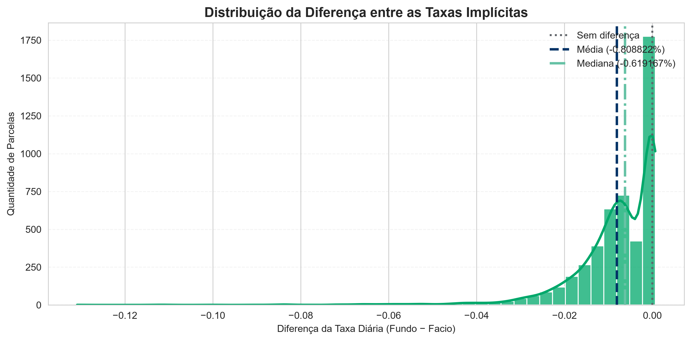
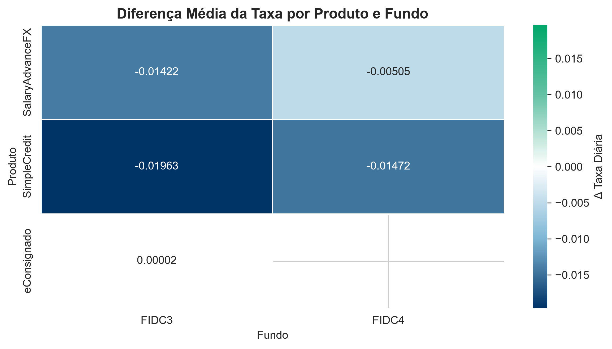

# Relatório Técnico – Case Facio

## Conciliação Financeira entre Carteira Facio e Fundos

**Business Analyst Skills Case**

**Autor:** Caah Paiva

---

# Sumário

1. Objetivo
2. Contexto do Negócio
3. Arquitetura da Solução
4. Metodologia
5. Premissas Adotadas
6. Validação e Tratamento dos Dados
7. Questão 1 – Reconciliação da Carteira

---

# Objetivo

Este relatório apresenta a solução desenvolvida para o **Business Analyst Skills Case – Facio**, cujo objetivo consiste em realizar a conciliação financeira entre a posição interna da Facio e a posição reportada pelos Fundos de Investimento em Direitos Creditórios (FIDCs), identificando divergências operacionais e financeiras e propondo ações de melhoria para o processo de reconciliação.

Além da implementação técnica, foram desenvolvidas análises financeiras para:

* calcular o Valor Presente (VP) da carteira da Facio;
* conciliar as posições entre Facio e Fundo;
* identificar divergências financeiras;
* avaliar a exposição da carteira;
* investigar diferenças nas taxas implícitas;
* analisar a composição do portfólio;
* propor hipóteses de causa-raiz e um fluxo de tratamento operacional.

Toda a solução foi implementada em Python, com estrutura modular, geração automática de indicadores, gráficos e tabelas, permitindo reprodutibilidade e facilidade de manutenção.

---

# Contexto do Negócio

A Facio origina operações de crédito e realiza a cessão de parte dessas operações para fundos de securitização (FIDC3 e FIDC4). Cada parcela cedida possui um valor de cessão, um valor nominal e datas de cessão e vencimento. O gestor do fundo, por sua vez, mantém uma posição da carteira precificada a valor presente.

Como a posição da Facio é mantida com base nas informações da operação original, enquanto a posição do fundo é calculada a valor presente, torna-se necessário trazer ambas para a mesma base financeira antes da conciliação. O case solicita exatamente essa implementação, incluindo o cálculo da taxa diária implícita, do valor presente e a comparação entre as duas posições.

---

# Arquitetura da Solução

O projeto foi organizado em uma estrutura modular para separar claramente as etapas de preparação, processamento, análise e documentação.

```text
case_facio_financial_reconciliation/

├── analysis/
├── data/
│   ├── raw/
│   └── processed/
├── notebooks/
│   └── 01_reconciliation_analysis.ipynb
├── outputs/
│   ├── figures/
│   ├── tables/
│   └── reports/
├── scripts/
│   ├── validate_and_clean.py
│   ├── reconciliation.py
│   └── case_facio.py
├── report.md
├── one_page.md
└── README.md
```

Essa organização facilita a reutilização dos componentes, a manutenção do código e a rastreabilidade dos artefatos produzidos durante a análise.

---

# Metodologia

A solução foi construída em cinco etapas principais.

## 1. Tratamento dos Dados

Inicialmente os dois datasets foram submetidos a um processo de padronização para garantir consistência entre as bases.

Foram realizadas as seguintes etapas:

* normalização de textos;
* padronização dos nomes das colunas;
* normalização do número da parcela;
* conversão de datas;
* tratamento de valores ausentes;
* validação dos tipos das variáveis;
* criação da chave de conciliação.

Essa etapa reduz o risco de falsos negativos durante o processo de reconciliação.

---

## 2. Construção da Chave de Conciliação

Cada parcela foi identificada por uma chave única composta por:

```text
id_contrato + parcela
```

Essa chave permite localizar exatamente a mesma parcela nas duas bases, independentemente de diferenças de formatação.

---

## 3. Cálculo Financeiro

Conforme definido no enunciado do case, a taxa diária implícita foi obtida a partir do valor de cessão, valor nominal e prazo entre cessão e vencimento. Em seguida, foi recalculado o Valor Presente de cada parcela na data de referência utilizando juros compostos diários.

Os principais indicadores calculados foram:

* taxa diária implícita;
* Valor Presente Calculado;
* diferença absoluta entre os valores presentes;
* diferença percentual.

---

## 4. Processo de Conciliação

Após o recálculo do Valor Presente, os datasets foram conciliados utilizando a chave composta por contrato e parcela.

Cada registro foi classificado conforme a seguinte taxonomia:

| Status          | Descrição                                                             |
| --------------- | --------------------------------------------------------------------- |
| Match Exact     | Registro encontrado nas duas bases sem diferença financeira relevante |
| Match Divergent | Registro encontrado nas duas bases com divergência de Valor Presente  |
| Only Facio      | Registro existente apenas na posição da Facio                         |
| Only Fundo      | Registro existente apenas na posição do Fundo                         |

Essa classificação serviu como base para todas as análises posteriores.

---

## 5. Geração dos Indicadores

Ao final do processamento foram produzidos automaticamente:

* KPIs financeiros;
* tabelas analíticas;
* gráficos executivos;
* indicadores de concentração;
* análise da taxa implícita;
* métricas de duration;
* análises de causa-raiz.

Todos os gráficos seguem o mesmo padrão visual utilizado ao longo do projeto.

---

# Premissas Adotadas

Para garantir consistência durante a análise foram adotadas as seguintes premissas:

* a combinação entre contrato e parcela identifica unicamente cada ativo;
* registros inexistentes em uma das bases são classificados como **Only Facio** ou **Only Fundo**;
* diferenças financeiras são avaliadas pela diferença absoluta entre os valores presentes;
* a taxa implícita é calculada apenas quando existem informações suficientes para o cálculo;
* a duration considera apenas ativos ainda não vencidos e utiliza o Valor Presente como ponderador.

---

# Validação e Tratamento dos Dados

Antes do início das análises foi executada uma etapa de validação da qualidade dos dados.

As principais verificações realizadas foram:

### Padronização das Colunas

Os nomes das colunas foram convertidos para um padrão único, permitindo que todo o pipeline utilizasse a mesma nomenclatura.

---

### Conversão de Tipos

Foram convertidos automaticamente:

* datas;
* campos monetários;
* identificadores;
* parcelas.

Essa etapa evita inconsistências durante os cálculos financeiros.

---

### Normalização das Parcelas

Os identificadores de parcela foram normalizados para garantir consistência na construção da chave de conciliação.

Exemplo:

| Valor Original | Valor Normalizado |
| -------------- | ----------------- |
| 1              | 001               |
| 9              | 009               |
| 12             | 012               |

---

### Verificação de Valores Ausentes

Foram avaliados campos obrigatórios utilizados nos cálculos de Valor Presente, evitando que registros incompletos impactassem a conciliação.

---

### Consistência das Datas

Também foram verificadas inconsistências entre:

* data de cessão;
* data de referência;
* data de vencimento.

Registros inválidos foram tratados antes da etapa de cálculo financeiro.

---

# Preparação para a Questão 1

Concluída a etapa de preparação dos dados, foi possível implementar o processo de conciliação solicitado no case.

A Questão 1 contempla:

* cálculo da taxa diária implícita;
* cálculo do Valor Presente na data de referência;
* conciliação entre as posições da Facio e do Fundo;
* classificação dos registros;
* geração dos principais indicadores de reconciliação.

Os resultados detalhados, incluindo KPIs, gráficos e análises executivas, são apresentados na próxima seção do relatório.


# Questão 1 – Implementação da Conciliação da Carteira

## Objetivo

A Questão 1 representa a etapa central deste case e consiste em implementar um processo de conciliação entre a posição da carteira da Facio e a posição reportada pelo gestor do Fundo. Conforme especificado no enunciado, a solução contempla o cálculo da taxa diária implícita de cada parcela, o recálculo do Valor Presente (VP) na data de referência, a conciliação entre as duas bases e a definição de uma taxonomia de status para classificação dos registros.

---

# Metodologia

O processo de conciliação foi dividido em cinco etapas:

1. Cálculo da taxa diária implícita;
2. Recalculo do Valor Presente na data de referência;
3. Conciliação entre as bases da Facio e do Fundo;
4. Classificação dos registros conciliados;
5. Geração de indicadores (KPIs) e visualizações.

A junção entre os datasets foi realizada utilizando uma chave composta por:

```text
id_contrato + parcela
```

Após o *merge*, cada registro recebeu um status de reconciliação conforme sua presença nas duas bases e a diferença entre o Valor Presente Calculado e o Valor Presente informado pelo Fundo.

---

# Cálculo da Taxa Diária Implícita

Como a taxa diária não é fornecida no dataset, ela foi obtida a partir das informações da própria cessão, conforme a metodologia descrita no enunciado do case. Foram utilizados:

* Valor de Cessão (VC);
* Valor Nominal (VN);
* Data da Cessão;
* Data de Vencimento.

Essa taxa representa o desconto diário implícito negociado entre a Facio e o Fundo durante a cessão da operação.

---

# Recalculo do Valor Presente

Após a obtenção da taxa diária, foi recalculado o Valor Presente de todas as parcelas na data de referência.

Esse valor passou a representar a posição financeira da Facio sob a mesma convenção utilizada pelo Fundo, permitindo uma comparação consistente entre as duas bases.

Além do VP, também foram calculados:

* diferença absoluta entre os valores presentes;
* diferença percentual;
* prazo remanescente até o vencimento.

---

# Taxonomia da Conciliação

Para facilitar a interpretação dos resultados foi proposta a seguinte classificação:

| Status              | Critério                                                                                  |
| ------------------- | ----------------------------------------------------------------------------------------- |
| **Match Exact**     | Registro encontrado nas duas bases com diferença financeira inferior à tolerância adotada |
| **Match Divergent** | Registro encontrado nas duas bases, porém com divergência de Valor Presente               |
| **Only Facio**      | Registro existente apenas na posição da Facio                                             |
| **Only Fundo**      | Registro existente apenas na posição reportada pelo Fundo                                 |

Essa classificação permite distinguir problemas de integração de dados de diferenças efetivas na metodologia de cálculo financeiro.

---

# Indicadores Produzidos

A rotina gera automaticamente um conjunto de indicadores utilizados ao longo das análises:

* quantidade de registros por status;
* exposição financeira por status;
* exposição por produto;
* exposição por fundo;
* diferença absoluta do Valor Presente;
* diferença percentual;
* estatísticas consolidadas da conciliação.

Além das tabelas analíticas, os resultados são exportados automaticamente para a pasta:

```text
outputs/tables/
```

e os gráficos para:

```text
outputs/figures/
```

---

# Resultado da Conciliação

## Distribuição por Status

A execução da rotina resultou na seguinte distribuição:

| Status          | Quantidade | Exposição Financeira |
| --------------- | ---------: | -------------------: |
| Match Exact     | **35.849** |  **R$ 6,64 milhões** |
| Match Divergent |  **4.846** |   **R$ 1,15 milhão** |
| Only Fundo      |  **9.295** |   **R$ 1,45 milhão** |
| Only Facio      |      **9** |         **R$ 1 mil** |

Esses resultados demonstram que aproximadamente **72% da carteira** apresentou conciliação sem divergências relevantes, enquanto cerca de **28%** demandam algum tipo de investigação operacional ou financeira.

---

## Distribuição dos Status

A figura abaixo resume visualmente a participação de cada categoria da taxonomia de conciliação.

```markdown

```

O gráfico evidencia que a maior parte da carteira encontra-se conciliada (**Match Exact**), mas também destaca a materialidade dos registros classificados como **Only Fundo**, que representam o principal ponto de atenção operacional.

---

# Breakdown da Carteira por Produto

Também foi calculada a exposição consolidada por produto.

| Produto         | Exposição Financeira |
| --------------- | -------------------: |
| SimpleCredit    |  **R$ 5,38 milhões** |
| SalaryAdvanceFX |  **R$ 2,33 milhões** |
| eConsignado     |        **R$ 72 mil** |

```markdown

```

### Análise

O produto **SimpleCredit** representa a maior parcela da carteira conciliada, seguido por **SalaryAdvanceFX**. Essa distribuição é importante porque os produtos de maior exposição tendem a concentrar também maior impacto financeiro quando ocorrem divergências.

---

# Breakdown da Carteira por Fundo

A exposição financeira também foi consolidada por fundo.

| Fundo | Exposição Financeira |
| ----- | -------------------: |
| FIDC4 |  **R$ 8,24 milhões** |
| FIDC3 |       **R$ 989 mil** |

```markdown

```

### Análise

Observa-se elevada concentração da carteira no **FIDC4**, responsável pela maior parte da exposição financeira. Esse comportamento reforça a necessidade de monitoramento específico desse fundo, uma vez que eventuais divergências podem gerar impacto financeiro mais relevante para a operação.

---

# Principais Achados

A conciliação permitiu identificar quatro comportamentos distintos na carteira:

### Match Exact

Representa registros em que o Valor Presente calculado pela Facio está consistente com o informado pelo Fundo, indicando alinhamento entre as posições.

### Match Divergent

Foram identificadas **4.846 parcelas** conciliadas pela chave, porém com divergências financeiras. Esse grupo indica que o ativo existe em ambas as bases, mas foi precificado de forma diferente, sugerindo diferenças de metodologia, convenção de dias ou políticas de arredondamento.

### Only Facio

Foram encontrados apenas **9 registros** presentes exclusivamente na posição da Facio. A baixa incidência sugere ocorrências pontuais, possivelmente relacionadas a atrasos de processamento ou diferenças de horário de corte.

### Only Fundo

O principal ponto de atenção identificado foi a existência de **9.295 registros** classificados como **Only Fundo**, representando aproximadamente **R$ 1,45 milhão** de exposição financeira sem correspondência na posição da Facio. Esse resultado sugere atrasos de atualização, falhas de sincronização entre sistemas ou diferenças no processo de baixa dos contratos.

---

# KPIs da Questão 1

Os principais indicadores produzidos nesta etapa foram:

* **35.849 registros** conciliados sem divergências relevantes;
* **4.846 registros** conciliados com divergência financeira;
* **9.295 registros** existentes apenas na posição do Fundo;
* **9 registros** existentes apenas na posição da Facio;
* **R$ 6,64 milhões** conciliados em Match Exact;
* **R$ 1,15 milhão** conciliados com divergência financeira;
* **R$ 1,45 milhão** de exposição associada ao status Only Fundo.

Esses KPIs servem como base para todas as análises apresentadas nas próximas seções do relatório.

---

# Conclusão da Questão 1

A implementação da conciliação permitiu transformar duas bases independentes em uma visão única da carteira, identificando tanto inconsistências operacionais quanto diferenças de precificação.

Os resultados mostram que a maior parte da carteira apresenta consistência entre as posições. Entretanto, a quantidade de registros classificados como **Only Fundo** e o volume de parcelas **Match Divergent** evidenciam oportunidades relevantes de melhoria no processo de integração e na padronização da metodologia de cálculo do Valor Presente.

A partir dessa base conciliada, torna-se possível aprofundar a análise da exposição financeira, investigar os contratos de maior impacto econômico e avaliar se as divergências decorrem de diferenças sistemáticas na taxa implícita utilizada pelos Fundos, temas abordados nas Questões 2 e 3.

# Questão 2 – Análise de Exposição Financeira

## Objetivo

Após a implementação da conciliação, o próximo passo consistiu em avaliar o impacto financeiro das divergências identificadas.

O objetivo desta etapa foi responder às seguintes questões:

* Qual a exposição financeira de cada status de conciliação?
* Quais produtos concentram maior risco financeiro?
* Como se distribuem as divergências de Valor Presente?
* Existem outliers relevantes?
* Quais contratos devem ser priorizados operacionalmente?

Todas as análises desta seção utilizam como referência o **Valor Presente Calculado**, obtido a partir da taxa diária implícita calculada na Questão 1.

---

# Metodologia

A análise foi desenvolvida em cinco etapas:

1. Exposição financeira por status;
2. Exposição financeira por produto;
3. Distribuição das divergências financeiras;
4. Identificação de outliers;
5. Investigação das dez maiores divergências.

Os resultados foram exportados automaticamente para:

```text
outputs/tables/
```

e as visualizações para:

```text
outputs/figures/
```

---

# Exposição Financeira por Status

A primeira análise buscou responder qual categoria da taxonomia representa maior impacto financeiro para a operação.

## Gráfico

```markdown

```

## Arquivo Gerado

```text
outputs/tables/exposure_by_status.csv
```

### Análise

A maior parte do Valor Presente encontra-se concentrada em registros classificados como **Match Exact**, indicando elevado nível de consistência entre as posições.

Entretanto, os grupos **Match Divergent** e **Only Fundo** concentram praticamente toda a exposição sujeita a investigação operacional.

Enquanto **Match Divergent** representa diferenças de precificação entre duas posições existentes, **Only Fundo** representa ativos registrados apenas pelo gestor, caracterizando potencial inconsistência operacional.

---

# Exposição Financeira por Produto

Também foi consolidada a exposição por produto.

## Gráfico

```markdown

```

## Arquivo Gerado

```text
outputs/tables/exposure_by_product.csv
```

### Principais Achados

Observou-se elevada concentração da carteira em **SimpleCredit**, seguido por **SalaryAdvanceFX**.

Embora **eConsignado** represente menor volume financeiro, sua participação continua sendo monitorada para identificar eventuais comportamentos distintos em relação aos demais produtos.

Essa segmentação permite direcionar futuras investigações para produtos com maior materialidade financeira.

---

# Distribuição das Divergências Financeiras

Foram analisadas todas as parcelas classificadas como **Match Divergent**.

Para cada registro foi calculada a diferença absoluta entre:

* Valor Presente Calculado;
* Valor Presente informado pelo Fundo.

Foram produzidas estatísticas descritivas contemplando:

* média;
* mediana;
* desvio padrão;
* mínimo;
* máximo;
* percentis.

---

## Histograma

```markdown

```

O histograma demonstra que a maior parte das divergências encontra-se concentrada em valores reduzidos, indicando boa aderência entre as metodologias de cálculo.

Entretanto, observa-se uma cauda à direita composta por poucos contratos com diferenças significativamente superiores à média.

---

## Boxplot

```markdown

```

O boxplot evidencia claramente a existência de valores extremos (outliers), reforçando que parte relevante do risco financeiro está concentrada em poucos contratos.

---

# Identificação de Outliers

Os outliers foram identificados utilizando análise exploratória baseada na distribuição da divergência absoluta.

Essa abordagem permite distinguir diferenças operacionais usuais de registros potencialmente críticos.

## Arquivo Gerado

```text
outputs/tables/outliers_divergencia.csv
```

### Conclusão

Os contratos classificados como outliers devem compor uma fila prioritária de investigação, pois concentram parcela desproporcional do risco financeiro da carteira.

---

# Top 10 Maiores Divergências

Além da visão agregada, foi realizada uma investigação individual das dez parcelas com maior divergência financeira.

## Arquivo Gerado

```text
outputs/tables/top10_divergencias.csv
```

Cada registro apresenta:

* contrato;
* parcela;
* produto;
* fundo;
* prazo remanescente;
* taxa diária implícita;
* Valor Presente Calculado;
* Valor Presente Fundo;
* divergência absoluta;
* divergência percentual.

---

## Gráfico

```markdown

```

### Principais Achados

A análise das dez maiores divergências revelou concentração em poucos contratos, pertencentes majoritariamente aos produtos de maior exposição financeira.

Além disso, observou-se predominância de registros vinculados ao **FIDC4**, indicando que o risco financeiro não está distribuído uniformemente pela carteira.

A análise conjunta de produto, fundo, prazo e taxa implícita permitiu identificar que as maiores diferenças estão concentradas em grupos específicos de ativos, direcionando de forma objetiva a priorização operacional.

---

# Avaliação do Risco Financeiro

Considerando simultaneamente quantidade de registros e materialidade financeira, os status podem ser priorizados da seguinte forma:

| Prioridade | Status          | Justificativa                                                  |
| ---------- | --------------- | -------------------------------------------------------------- |
| Alta       | Only Fundo      | Alto volume financeiro sem correspondência na posição da Facio |
| Alta       | Match Divergent | Divergência de precificação entre as bases                     |
| Média      | Only Facio      | Baixa incidência e reduzida exposição financeira               |
| Baixa      | Match Exact     | Carteira conciliada                                            |

---

# Conclusão da Questão 2

A análise demonstra que o risco financeiro da operação não está associado apenas ao número de divergências, mas principalmente à concentração financeira em poucos contratos e fundos específicos.

Os resultados reforçam a importância de uma estratégia de priorização baseada em materialidade financeira, permitindo que os esforços operacionais sejam direcionados para ativos de maior impacto econômico.

---

# Questão 3 – Análise da Taxa Implícita do Fundo

## Objetivo

A Questão 3 busca investigar se as divergências identificadas na Questão 2 decorrem da utilização de metodologias diferentes para cálculo da taxa diária implícita.

Para isso, foi estimada a taxa implícita utilizada pelo Fundo em todas as parcelas classificadas como **Match Divergent**, comparando-a com a taxa calculada a partir da posição da Facio.

---

# Metodologia

A análise foi realizada apenas para registros conciliados presentes nas duas bases.

Para cada parcela foram calculados:

* taxa diária implícita da Facio;
* taxa diária implícita estimada do Fundo;
* diferença absoluta entre as taxas.

Esses resultados foram utilizados para avaliar:

* distribuição das diferenças;
* existência de viés sistemático;
* comportamento por produto;
* comportamento por fundo.

---

# Distribuição das Diferenças de Taxa

Inicialmente foi analisada a distribuição da variável **i_diff**.

## Gráfico

```markdown

```

A distribuição mostra concentração próxima de zero, indicando que, na maioria dos contratos, as metodologias apresentam comportamento semelhante.

Entretanto, observa-se uma dispersão em torno da média, evidenciando diferenças pontuais que justificam investigação adicional.

---

# Heatmap da Diferença Média de Taxa

Para identificar possíveis padrões operacionais foi construída uma matriz contendo a diferença média das taxas por produto e por fundo.

## Gráfico

```markdown

```

A utilização da mesma paleta institucional adotada nos demais gráficos facilita a comparação visual entre os grupos analisados.

---

# Diferença Média por Produto

Também foram calculadas estatísticas consolidadas para cada produto.

## Arquivo Gerado

```text
outputs/tables/delta_taxa_produto.csv
```

Essa análise permite identificar se algum produto utiliza sistematicamente uma convenção de taxa distinta.

---

# Diferença Média por Fundo

Da mesma forma, foram consolidados os resultados por fundo.

## Arquivo Gerado

```text
outputs/tables/delta_taxa_fundo.csv
```

Essa segmentação evidencia possíveis diferenças metodológicas entre gestores.

---

# Principais Achados

A comparação entre as taxas implícitas indica que:

* a maior parte das diferenças permanece próxima de zero;
* alguns produtos apresentam maior dispersão;
* determinados fundos concentram diferenças médias superiores aos demais;
* não há evidências de erro sistêmico na metodologia da Facio, mas sim indícios de utilização de convenções distintas para cálculo do Valor Presente.

Esses resultados são consistentes com as divergências observadas na Questão 2.

---

# Conclusão da Questão 3

A análise das taxas implícitas demonstra que parte das divergências financeiras decorre de diferenças na metodologia de precificação utilizada pelos Fundos.

As evidências sugerem que determinados produtos e fundos utilizam convenções de taxa ligeiramente diferentes daquelas empregadas pela Facio, o que explica parte dos registros classificados como **Match Divergent**.

Esses resultados reforçam a necessidade de alinhamento metodológico entre as partes, reduzindo divergências operacionais e aumentando a consistência da conciliação financeira.

# Questão 4 – Análise de Composição e Concentração do Portfólio

## Objetivo

Após validar a conciliação da carteira e investigar as divergências financeiras e de precificação, esta etapa tem como objetivo compreender a composição da carteira sob a ótica de concentração, prazo e liquidez.

As análises desenvolvidas permitem responder:

* Qual o Valor Presente total por Fundo e por Produto?
* Como a carteira está distribuída por prazo?
* Qual a duration média ponderada de cada Fundo?
* Qual percentual da carteira vence nos próximos 30 dias?
* Existem riscos relevantes de concentração?

---

# Metodologia

Foram utilizadas exclusivamente as parcelas da posição da Facio após o cálculo do Valor Presente.

As análises contemplam:

1. Exposição por Fundo;
2. Exposição por Produto;
3. Distribuição por buckets de prazo;
4. Duration média ponderada;
5. Concentração de vencimentos.

---

# Composição do Portfólio por Fundo

Foi calculado o Valor Presente total pertencente a cada Fundo.

## Gráfico

```markdown

```

## Arquivo Gerado

```text
outputs/tables/carteira_por_fundo.csv
```

### Análise

Observa-se elevada concentração da carteira no **FIDC4**, responsável pela maior parcela do Valor Presente do portfólio.

Embora o FIDC3 possua participação relevante, seu peso financeiro é significativamente inferior.

Essa concentração aumenta a dependência operacional em relação ao FIDC4, tornando prioritário o monitoramento das divergências associadas a esse Fundo.

---

# Composição do Portfólio por Produto

Também foi consolidada a exposição financeira por produto.

## Gráfico

```markdown

```

## Arquivo Gerado

```text
outputs/tables/carteira_por_produto.csv
```

### Análise

A carteira apresenta predominância do produto **SimpleCredit**, seguido por **SalaryAdvanceFX**.

O produto **eConsignado** representa pequena parcela do portfólio.

Esse comportamento é coerente com as análises apresentadas anteriormente, nas quais os produtos de maior exposição também concentraram maior número de divergências relevantes.

---

# Distribuição por Buckets de Prazo

Foi criada uma segmentação considerando o prazo remanescente até o vencimento.

Foram definidos quatro grupos:

| Bucket         | Dias Corridos     |
| -------------- | ----------------- |
| Curto Prazo    | até 30 dias       |
| Médio Prazo I  | 30–90 dias        |
| Médio Prazo II | 90–180 dias       |
| Longo Prazo    | acima de 180 dias |

## Gráfico

```markdown

```

## Arquivo Gerado

```text
outputs/tables/buckets_prazo.csv
```

### Interpretação

A distribuição evidencia a composição temporal da carteira.

Carteiras concentradas em prazos curtos apresentam maior velocidade de renovação e menor sensibilidade à taxa de desconto.

Já carteiras concentradas em prazos longos possuem maior duration e maior sensibilidade a alterações na curva de juros.

---

# Duration Média Ponderada

Foi calculada a duration média ponderada pelo Valor Presente para cada Fundo.

A métrica foi utilizada como uma aproximação do prazo médio financeiro da carteira.

## Arquivo Gerado

```text
outputs/tables/duration_fundos.csv
```

### Análise

O Fundo com maior duration apresenta maior exposição ao risco de taxa de juros.

Além disso, alterações na metodologia de precificação tendem a produzir maior impacto financeiro em ativos de prazo mais longo.

---

# Concentração dos Próximos Vencimentos

Também foi calculado o percentual do Valor Presente que vence nos próximos 30 dias.

## Gráfico

```markdown

```

## Arquivo Gerado

```text
outputs/tables/vencimentos_30_dias.csv
```

### Interpretação

Esse indicador funciona como uma proxy de risco de liquidez.

Fundos com elevada concentração de vencimentos em curto prazo exigem maior acompanhamento operacional para evitar impactos de caixa e diferenças de contabilização.

---

# Principais Resultados da Questão 4

As análises mostram que:

* existe concentração relevante da carteira no FIDC4;
* SimpleCredit representa a maior exposição financeira;
* a carteira apresenta distribuição equilibrada entre os buckets de prazo;
* parte relevante do Valor Presente vence em horizonte inferior a 30 dias;
* a duration média difere entre os Fundos, indicando perfis distintos de risco.

---

# Conclusão da Questão 4

A análise da composição do portfólio complementa a conciliação financeira ao evidenciar onde o risco está concentrado.

Os resultados demonstram que o monitoramento operacional deve considerar simultaneamente:

* exposição financeira;
* prazo remanescente;
* concentração por Fundo;
* concentração por Produto.

Essa abordagem permite priorizar contratos de maior impacto potencial para a operação.

---

# Questão 5 – Hipóteses de Causa-Raiz e Plano de Remediação

## Objetivo

A última etapa do case busca transformar os resultados quantitativos das análises anteriores em recomendações operacionais.

O objetivo consiste em identificar possíveis causas para cada categoria de divergência e propor um fluxo estruturado de tratamento.

---

# Análise por Categoria

## Only Facio

### Possíveis causas

* cessões realizadas recentemente;
* atraso na atualização da posição do Fundo;
* processamento ainda não concluído;
* diferenças de horário de corte.

### Riscos

* divergência temporária da carteira;
* atraso na contabilização;
* inconsistências em relatórios gerenciais.

### Criticidade

**Baixa**

A quantidade reduzida de registros indica ocorrência pontual.

---

## Only Fundo

### Possíveis causas

* baixa ainda não refletida pela Facio;
* atraso na integração entre sistemas;
* contratos liquidados no originador;
* inconsistências cadastrais.

### Riscos

* superavaliação da carteira do Fundo;
* diferenças contábeis;
* impacto financeiro em auditorias.

### Criticidade

**Alta**

Essa categoria apresentou maior exposição financeira entre os registros não conciliados.

---

## Match Divergent

### Possíveis causas

Com base nas análises da Questão 3, as divergências observadas são compatíveis com:

* utilização de convenções distintas para cálculo do Valor Presente;
* diferenças de arredondamento;
* calendário financeiro diferente;
* parametrização distinta da taxa implícita.

### Evidências

A comparação entre as taxas diárias demonstrou diferenças pequenas na maioria dos contratos, porém concentradas em determinados produtos e Fundos.

Esses indícios sugerem diferenças metodológicas e não falhas de cálculo da Facio.

---

# Fluxo de Tratamento Operacional

Foi proposto o seguinte fluxo para tratamento das divergências.

## Etapa 1 — Identificação

Execução automática da rotina de conciliação.

Responsável:

**Time de Dados**

Prazo:

**Diário**

---

## Etapa 2 — Classificação

Classificação automática conforme a taxonomia:

* Match Exact;
* Match Divergent;
* Only Facio;
* Only Fundo.

Responsável:

**Time Financeiro**

---

## Etapa 3 — Investigação

Análise individual dos contratos priorizados.

Critérios:

* maior exposição financeira;
* maior divergência absoluta;
* presença entre os Top 10;
* classificação como outlier.

---

## Etapa 4 — Escalonamento

Caso a divergência permaneça após a investigação inicial:

* acionar Operações;
* envolver Tecnologia quando houver falha sistêmica;
* envolver Gestor do Fundo quando houver diferença metodológica.

---

## Etapa 5 — Encerramento

A divergência é encerrada somente após:

* regularização da posição;
* validação financeira;
* atualização da base conciliada.

---

# Matriz de Prioridade

| Categoria       | Criticidade | SLA           |
| --------------- | ----------- | ------------- |
| Match Exact     | Muito Baixa | Monitoramento |
| Match Divergent | Alta        | 2 dias úteis  |
| Only Facio      | Média       | 3 dias úteis  |
| Only Fundo      | Muito Alta  | 1 dia útil    |

---

# Recomendações

Com base nas análises realizadas, recomenda-se:

* automatizar a rotina diária de conciliação;
* criar monitoramento contínuo dos KPIs;
* revisar a convenção de cálculo do Valor Presente entre Facio e Gestores;
* estabelecer alertas automáticos para outliers;
* priorizar contratos de maior materialidade financeira;
* acompanhar separadamente produtos e Fundos com maior recorrência de divergências.

---

# Conclusão Executiva

O desenvolvimento deste case permitiu construir uma solução completa de conciliação financeira, contemplando desde a preparação dos dados até a investigação de causas operacionais.

Os principais resultados obtidos foram:

* implementação automatizada da conciliação da carteira;
* cálculo da taxa diária implícita e do Valor Presente;
* classificação estruturada dos registros conciliados;
* identificação das maiores divergências financeiras;
* investigação das diferenças de precificação entre Facio e Fundo;
* análise da composição e concentração do portfólio;
* proposta de fluxo operacional para tratamento dos breaks.

Além de atender integralmente aos requisitos técnicos do case, a solução foi desenvolvida com foco em reprodutibilidade, organização do código e geração automática de artefatos analíticos.

O projeto entrega não apenas uma resposta às perguntas propostas, mas uma base sólida para evolução do processo de conciliação financeira da operação, permitindo maior confiabilidade dos dados, redução do risco operacional e suporte à tomada de decisão.
